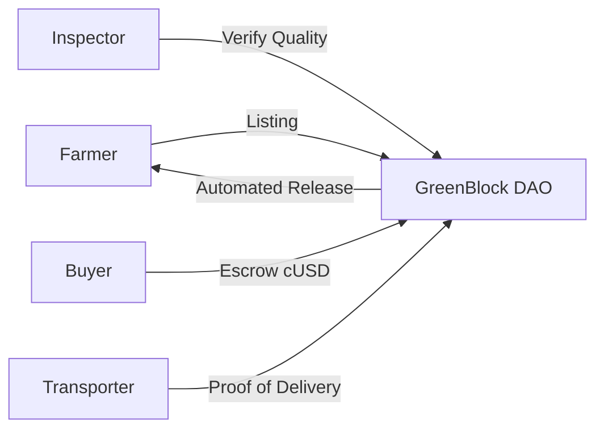

# GreenBlock — Regenerative Agriculture DAO

**Built for ETHPrague 2026 — ReFi & Sustainability Track**

## 🌿 The Vision

Small-scale farmers are the backbone of the global food supply, yet they are excluded from
institutional finance. **GreenBlock** leverages Ethereum (Gnosis Chain/Celo) to provide a
transparent, decentralized, and regenerative marketplace for agricultural commodities.

By tokenizing the trade lifecycle and integrating real-world asset (RWA) escrow, GreenBlock ensures
farmers get paid fairly and instantly, while buyers can verify the regenerative practices used on
the ground.

## 🛠️ Technology Stack

- **Blockchain (EVM):** Solidity smart contracts on **Gnosis Chain** and **Celo**.
- **Escrow:** Multi-party stablecoin (cUSD/EURe) escrow for secure cross-border trade.
- **Mobile-First:** React Native + Expo for on-site use by farmers and inspectors in remote areas.
- **Transparency:** Every trade phase (Inspection → Transport → Delivery) is a verifiable event
  on-chain.
- **Identity:** Privacy-preserving KYC via **Privy** and **zk-Identity** concepts.

## 📦 Key Features (formerly AgroTrade)

- **Regenerative Inspections:** A decentralized network of inspectors score farms on biodiversity
  and soil health (0-100 scale).
- **Dual-Chain Settlement:** Choice of Gnosis Chain (local efficiency) or Celo (mobile-native).
- **Transparent Logistics:** Transporters bid on jobs and provide proof-of-delivery (PoD) on-chain.
- **DAO Governance:** Token holders vote on quality standards and regional resource allocation for
  farming equipment.

## 🏗️ ReFi Architecture

## 📅 ETHPrague Roadmap

1. **[X] Core Escrow:** Battle-tested Solidity contracts.
2. **[ ] Gnosis Deployment:** Migrate Celo contracts to Gnosis Chain for the Prague local ecosystem.
3. **[ ] Regenerative Dashboard:** Add "Carbon/Soil Health" metrics to the seller profiles.
4. **[ ] DAO Governance:** Simple snapshot/on-chain voting mockup for quality standards.

---

_GreenBlock: Empowering the next generation of regenerative farmers._
