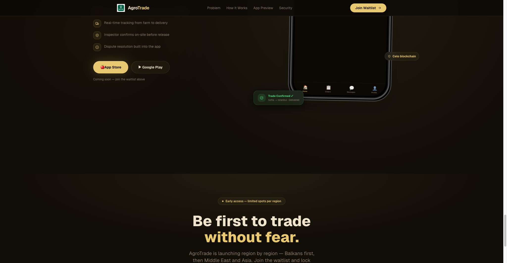

<div align="center">


# AgroTrade

### Agricultural Commodity Escrow Infrastructure

**Mobile-first · Stablecoin-settled · Compliance-aware · EU expansion path**

[Demo](#live-demo) · [Architecture](#architecture) · [Docs](#documentation) · [Quick Start](#quick-start)



</div>

---

## The Problem

Agricultural commodity trade still runs on **phone calls, paper, and trust**.

- A farmer in rural Bulgaria lists grain by WhatsApp. A buyer in Germany finds them through a broker. Payment happens **30–60 days after delivery** — if it happens at all.
- Truckers bid on transport jobs through informal networks. No escrow means the farmer ships first and hopes; the buyer pays first and hopes.
- Quality inspection is a paper certificate that can be forged, delayed, or lost at a border.

**Result:** Small farmers are excluded from institutional buyers. Cross-border trade within the EU is slower than it should be. Payment defaults and disputes are routine.

> The EU is trying to fix this with regulation — but nobody has built the infrastructure yet.

---

## What We Built

AgroTrade is a **mobile-first agricultural commodity escrow platform** that connects five actors on a single, enforceable trade lifecycle.

| Actor | What They Do |
|-------|-------------|
| **Farmer** | Lists commodities, receives offers, accepts/rejects/counters, schedules inspection |
| **Buyer** | Posts requirements with budget and quality specs, tracks fulfillment end-to-end |
| **Transporter** | Bids on logistics jobs, GPS-tracks the route, confirms pickup and delivery |
| **Inspector** | Visits the farm, scores quality 0–100, uploads photo evidence |
| **Admin** | Matches sellers to buyers, assigns inspectors, approves bids, finalizes trades |

**The currency is stablecoin (cUSD on Celo, USDC on Solana).** No crypto volatility. No banking delays. Delivery confirmation triggers escrow release.

---

## Live Demo

### Try the Mobile App

Scan the QR code with **Expo Go** (iOS or Android) to launch the app instantly:

<div align="center">

```
┌─────────────────┐
│  📱 EXPO GO     │
│                 │
│  [ QR CODE ]    │
│  COMING SOON    │
│                 │
└─────────────────┘
```

**Or run locally:**
```bash
cd front-end
npx expo start
# Scan the QR code with Expo Go
```

</div>

### Demo Credentials

| Role | Email | Password |
|------|-------|----------|
| Admin | `admin@agrotrade.com` | `admin123` |
| Farmer | `seller1@agrotrade.com` | `password123` |
| Buyer | `buyer@agrotrade.com` | `password123` |

> **Zurich Demo Day — May 28, 2026**  
> Demo access and walkthrough materials are prepared for sponsor and judge conversations.

---

## How a Trade Works (9-Phase State Machine)

**Example:** *A wheat farmer in Plovdiv sells 50 tonnes to a flour mill in Munich.*

```
1. INITIATION           → Buyer posts: "50t wheat, protein >12%, delivery by June 15"
2. SELLER_MATCHING      → Admin sees matching farmers on a map, selects 3 candidates
3. SELLER_NEGOTIATION   → Platform sends offers; farmers can ACCEPT / REJECT / COUNTER
                          (Offers expire in 48h — no ghosting)
4. INSPECTION_PENDING   → Inspector visits the farm, scores quality, uploads photos
                          PASS → proceed. FAIL → farmer removed from trade.
5. TRANSPORT_MATCHING   → Admin creates a transport request: pickup points, delivery address
6. TRANSPORT_BIDDING    → Truckers bid price + trucks + timeline. 48h deadline.
7. IN_TRANSIT           → Trucker navigates to farm, confirms pickup, drives to Munich
8. DELIVERED            → Trucker confirms delivery. Buyer confirms receipt.
9. COMPLETED            → Admin finalizes. Escrow releases cUSD to farmer + trucker.
```

**Any phase can → CANCELLED — except COMPLETED.** The state machine is enforced in both the backend and on-chain.

---

## Architecture

```
┌─────────────────────────────────────────────────────────────────────────────┐
│                         AGROTRADE PLATFORM                                   │
├──────────────┬──────────────┬──────────────┬────────────────────────────────┤
│   Mobile App │  Web Portal  │ Admin Dash   │  Backend API                   │
│  (Expo/RN)   │  (Next.js)   │  (React/Vite)│  (NestJS + Prisma + PostgreSQL)│
├──────────────┴──────────────┴──────────────┴────────────────────────────────┤
│                                                                              │
│  ┌─────────────────────────────────────────────────────┐                    │
│  │  COMPLIANCE LAYER (KYC · KYT · AML · Travel Rule)   │                    │
│  └─────────────────────────────────────────────────────┘                    │
│                                                                              │
│  ┌───────────────────┐    ┌───────────────────┐                             │
│  │   Celo Escrow     │    │  Solana Escrow    │                             │
│  │  (AgroEscrow.sol) │    │ (Anchor Program)  │                             │
│  │  cUSD · Foundry   │    │ USDC · SPL Token  │                             │
│  │  37 tests ✅       │    │ Devnet ready ✅    │                             │
│  └───────────────────┘    └───────────────────┘                             │
│                                                                              │
│  ┌─────────────────────────────────────────────────────┐                    │
│  │  DATA LAYER                                          │                    │
│  │  PostgreSQL · Prisma ORM · TradeEvents · Redis       │                    │
│  │  Full audit trail · Blockchain tx hashes · Metadata  │                    │
│  └─────────────────────────────────────────────────────┘                    │
└─────────────────────────────────────────────────────────────────────────────┘
```

### Tech Stack

| Layer | Technology | Scale |
|-------|-----------|-------|
| **Backend API** | NestJS + TypeScript + Prisma + PostgreSQL | 205 TS files |
| **Mobile App** | React Native + Expo 52 + NativeWind | 574 TS files, all 5 roles |
| **Admin Console** | React + Vite | Map-based matching, live trade ops |
| **Smart Contracts (Celo)** | Solidity + Foundry | 37 passing tests, custodial escrow |
| **Smart Contracts (Solana)** | Anchor + Rust + SPL Token | USDC escrow program, devnet workflow prepared |
| **Auth** | Privy (JWT + Google OAuth) | Role-based, wallet-managed |
| **Real-Time** | Socket.IO + Expo Push | Live phase-change notifications |
| **Compliance** | KYC / KYT / AML / Travel Rule | Every tx has on-chain hash + metadata |

**Key decision:** Custodial escrow. Admin authorization is required for every fund movement. This is not DeFi speculation; it is controlled trade infrastructure with human oversight.

---

## Compliance by Design

Designed with **regulated operating constraints**, **auditability**, and **Travel Rule-ready record keeping** in mind.

| Concern | Implementation |
|---------|---------------|
| **Identity** | Privy-powered auth with role-aware sessions and a path to tiered verification |
| **KYT-ready audit trail** | Trade and payment actions create `TradeEvent` records with actor, amount, timestamp, and blockchain references |
| **AML-aware controls** | No direct P2P transfers. Funds move through admin-gated escrow and a controlled operating model |
| **Travel Rule-ready data** | Trade records can capture originator, beneficiary, amount, purpose, and blockchain references at the workflow layer |
| **Custodial Gating** | Funds lock on `IN_TRANSIT`. Release on `DELIVERED`. Refunds only from `DISPUTED` state (admin review). |

> Most agritech platforms ignore financial compliance. AgroTrade treats it as a feature, not a bug.

---

## Project Grain Sovereign — The EU Regulatory Expansion

AgroTrade is the operational core. **Project Grain Sovereign** extends it upward into the EU institutional stack, transforming the platform into a **Digital Public Infrastructure (DPI)** provider.

| Pillar | What It Means | Concrete Output |
|--------|--------------|-----------------|
| **EU Data Act** | Mandatory B2G data sharing for food security | Read-only "Commission API" for DG AGRI |
| **CEADS** | Common European Agricultural Data Space | Federated data node across BG, FR, DE, RO |
| **EBSI** | European Blockchain Services Infrastructure | Freelance inspectors become **EBSI Trusted Issuers** — quality credentials verifiable across EU borders |
| **EU AI Act** | Voice-AI for non-literate farmers | Sandbox-tested voice assistant for trade creation |

**No precedent exists** for private agrifood inspectors as EBSI Trusted Issuers. Grain Sovereign generates the regulatory evidence that both industry and authorities need.

- **Spain AgriFoodTech Sandbox** — Submitted May 2026 (€46,000 trial)
- **ETHPrague 2026** — GreenBlock ReFi spinoff demoing the same escrow engine
- **EIC Accelerator** — €2.5M blended finance target, Oct 2026

---

## Traction

| Metric | Value |
|--------|-------|
| Smart contract tests | **37 passing** (Foundry, Celo) |
| Backend scenario tests | **9/10 passing** (67/67 steps) |
| Backend codebase | **205 TypeScript files** |
| Mobile codebase | **574 TypeScript files** |
| Trade phases modeled | **9 phases, 2 terminal states** |
| Compliance layers | **4 (KYC, KYT, AML, Travel Rule)** |
| Hackathon | **StableHacks 2026 Top 10** (Tenity × AMINA Bank × Solana Foundation) |
| Strategic expansion | **Project Grain Sovereign** EU data and compliance track |

---

## Quick Start

### Prerequisites
- Node.js 20+
- PostgreSQL
- Foundry (for contracts)

### Backend
```bash
cd backend
npm install
npx prisma migrate dev
npm run build
node dist/main.js
# API runs on http://localhost:4000
# Swagger docs: http://localhost:4000/api/docs/
```

### Mobile App
```bash
cd front-end
npm install
npx expo start
# Scan QR code with Expo Go (iOS / Android)
```

### Admin Dashboard
```bash
cd admin-dashboard
npm install
npm run dev
# Runs on http://localhost:5173
```

### Landing Page
```bash
cd landing
npm install
npm run dev
# Runs on http://localhost:3000
```

### Smart Contracts
```bash
cd contracts
forge test
# 37 tests should pass
```

---

## Documentation

| Doc | What It Covers |
|-----|---------------|
| [`docs/API_REFERENCE.md`](docs/API_REFERENCE.md) | Every endpoint — method, path, auth, body, response |
| [`docs/ARCHITECTURE.md`](docs/ARCHITECTURE.md) | System overview, user journeys, data model |
| [`docs/STATE_MACHINES.md`](docs/STATE_MACHINES.md) | All state transitions — trade, negotiations, transport, inspections |
| [`docs/COMPLIANCE_ARCHITECTURE.md`](docs/COMPLIANCE_ARCHITECTURE.md) | KYC, KYT, AML, Travel Rule |
| [`docs/MASTER_ROADMAP.md`](docs/MASTER_ROADMAP.md) | MVP roadmap, issues, phases |
| [`docs/TEST_SCENARIOS.md`](docs/TEST_SCENARIOS.md) | 10 simulation scenarios with exact API call sequences |
| [`docs/eu-strategy/`](docs/eu-strategy/) | Project Grain Sovereign — EU regulatory track |

---

## Related Projects

- **GreenBlock** — ETHPrague 2026 ReFi spinoff. Regenerative agriculture DAO built on AgroTrade escrow infrastructure. [`docs/eu-strategy/GREENBLOCK.md`](docs/eu-strategy/GREENBLOCK.md)

---

## Team & Contact

Built by a solo-founder team shipping across Web3, AI dev tooling, and games.

- **StableHacks 2026** — Top 10 finalist
- **Demo Day** — Zurich, May 28, 2026
- **Contact:** [founder@grainsovereign.eu]

---

*Last updated: 2026-05-05*
