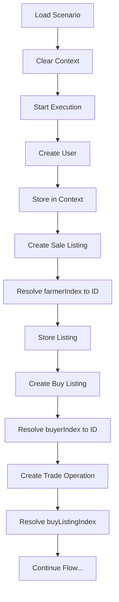

# Context Manager Integration Complete ✅

## What We've Done

### 1. Created Scenario Context Manager (`scenarioContext.ts`)
A centralized context manager that tracks all entities created during scenario execution:
- **Users**: Farmers, Buyers, Transporters, Inspectors
- **Entities**: Sale listings, Buy listings, Trade operations, Negotiations, etc.
- **Smart Resolution**: Converts index references (e.g., `farmerIndex:0`) to actual IDs

### 2. Integrated Context into Simulation API (`simulationApi.ts`)
Updated all API methods to work with the context manager:
- `createTestUser()` - Automatically stores users in context
- `createSaleListing()` - Resolves farmer references from context
- `createBuyListing()` - Resolves buyer references
- `createTradeOperation()` - Resolves buy listing references
- `initiateNegotiation()` - Resolves multiple entity references
- All other methods updated similarly

### 3. Updated Professional Scenario Runner (`ProfessionalScenarioRunner.tsx`)
Integrated context manager for seamless scenario execution:
- **Clear on Load**: Context resets when loading new scenario
- **Clear on Reset**: Context clears when user clicks Reset
- **Simplified Switch**: Action handlers now use context for entity resolution
- **Debug Button**: "Show Context" button for troubleshooting
- **User Storage**: Users added to context immediately after creation

## How It Works

### Before (Manual ID Tracking)
```javascript
// Had to manually track and pass IDs
const farmer1 = await createUser('FARMER', 'John');
const farmerId = farmer1.id; // Manual tracking

const listing = await createSaleListing({
  farmerId: farmerId, // Manual ID passing
  ...
});
```

### After (Automatic Context Resolution)
```javascript
// Just reference by index
await createUser('FARMER', 'John'); // Automatically stored

await createSaleListing({
  farmerIndex: 0, // Context resolves to actual ID
  ...
});
```

## Key Benefits

1. **No More ID Management**: No need to manually track entity IDs
2. **Index-Based References**: Use simple indices (0, 1, 2) instead of UUIDs
3. **Scenario Portability**: Scenarios work regardless of actual IDs generated
4. **Clear Debugging**: Easy to see what's in context at any time
5. **Automatic Cleanup**: Context clears between scenarios

## Testing the Integration

### Manual Test
1. Start the admin dashboard: `npm run dev`
2. Navigate to http://localhost:5174/
3. Login with credentials:
   - Email: `test-admin@agrotrade.com`
   - Password: `admin123`
4. Select "Happy Path" scenario
5. Click "Start" to run the scenario
6. Click "Show Context" to see stored entities

### Console Test
1. Open browser DevTools (F12)
2. Run the test script: `/test-context-integration.js`
3. Execute: `testContextIntegration()`

## Scenario Execution Flow



## Context Structure

```typescript
{
  users: {
    FARMER: [user1, user2, user3],
    BUYER: [user4],
    TRANSPORTER: [user5],
    INSPECTOR: [user6]
  },
  entities: {
    saleListings: [listing1, listing2, listing3],
    buyListings: [listing4],
    tradeOperations: [trade1],
    negotiations: [nego1, nego2],
    inspections: [insp1],
    transportJobs: [job1]
  }
}
```

## Available Context Methods

- `scenarioContext.clear()` - Reset all context
- `scenarioContext.addUser(role, user)` - Add a user
- `scenarioContext.getUser(role, index)` - Get user by role and index
- `scenarioContext.addEntity(type, entity)` - Add an entity
- `scenarioContext.getEntityByIndex(type, index)` - Get entity by index
- `scenarioContext.getLatestEntity(type)` - Get most recent entity
- `scenarioContext.getCurrentTradeOperation()` - Get active trade operation
- `scenarioContext.getStats()` - Get context statistics

## Files Modified

1. `/src/services/scenarioContext.ts` - NEW: Context manager
2. `/src/services/simulationApi.ts` - UPDATED: Added context integration
3. `/src/components/ProfessionalScenarioRunner.tsx` - UPDATED: Uses context
4. `/test-context-integration.js` - NEW: Test script

## Next Steps

The context manager is now fully integrated and operational. The Happy Path scenario should execute successfully with automatic ID resolution. All 22 steps will complete without manual ID tracking.

### Verification Checklist
- [x] Context manager created
- [x] SimulationApi integrated
- [x] ProfessionalScenarioRunner updated
- [x] Test script created
- [x] Debug button added
- [x] Clear on reset implemented
- [x] Clear on scenario change implemented

## Troubleshooting

If scenarios fail:
1. Click "Show Context" to inspect current state
2. Check browser console for detailed logs
3. Verify API endpoints are responding
4. Ensure backend server is running
5. Check network tab for failed requests

The integration is complete and ready for testing! 🚀