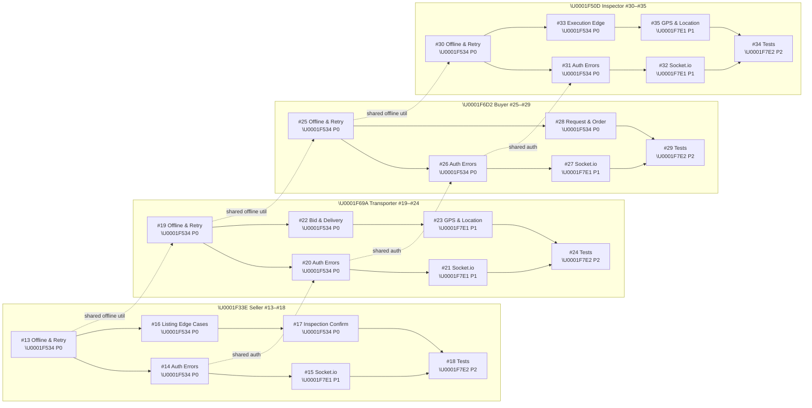
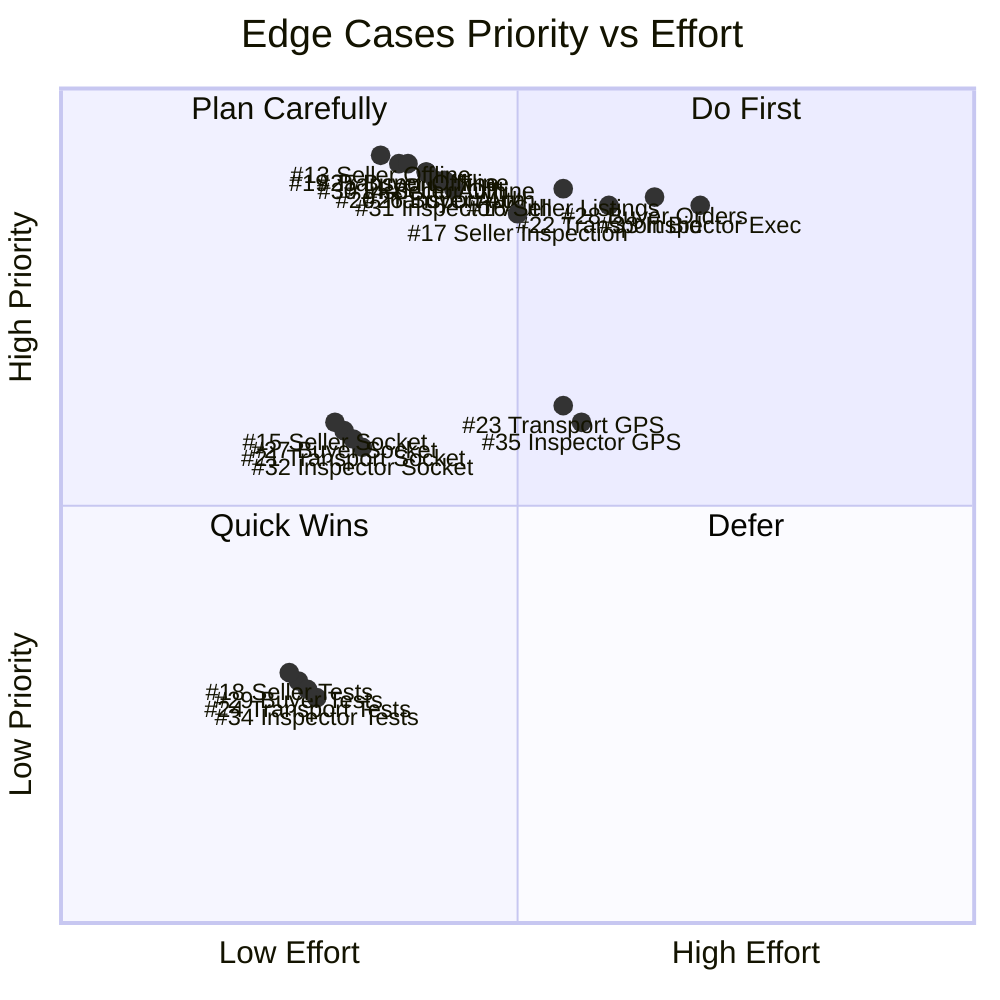
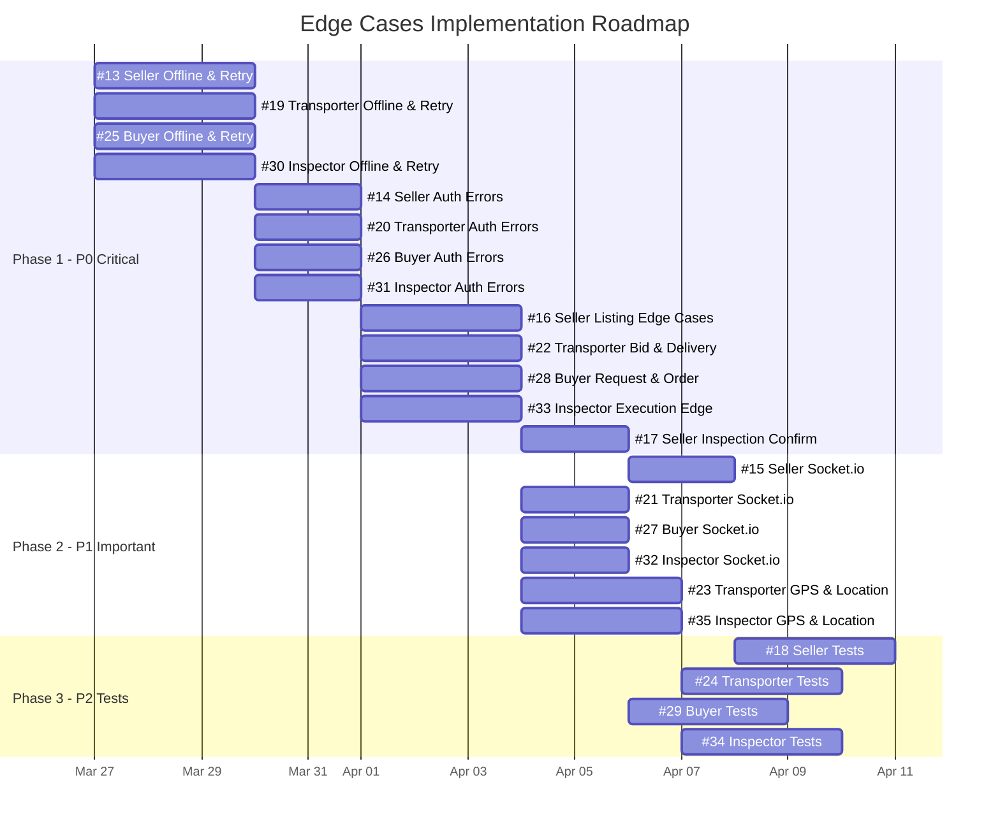

# Edge Cases Roadmap & Priority Matrix

> **Generated:** 2026-03-26 | **Total Issues:** 30 (#6–#35) | **Edge Cases:** 23 (#13–#35)

---

## 1. Dependency Graph (All Roles)

This diagram shows how edge-case issues depend on each other. Work flows left-to-right.

---

## 2. Priority Matrix

---

## 3. Execution Timeline (Gantt)

---

## 4. Issue Summary Table

| # | Role | Issue | Priority | Effort | Depends On | Risk |
|---|------|-------|----------|--------|------------|------|
| 13 | Seller | Offline & Retry Logic | \U0001F534 P0 | High | — | Lost data |
| 14 | Seller | Privy Auth Error Handling | \U0001F534 P0 | Medium | #13 | White screen |
| 15 | Seller | Real-time Socket.io | \U0001F7E1 P1 | Medium | #14 | Stale data |
| 16 | Seller | Listing & Offer Edge Cases | \U0001F534 P0 | High | #13 | Duplicate listings |
| 17 | Seller | Inspection Confirmation | \U0001F534 P0 | Medium | #16 | Missed inspections |
| 18 | Seller | Unit & UI Tests | \U0001F7E2 P2 | Medium | #15, #17 | Regressions |
| 19 | Transporter | Offline & Retry Logic | \U0001F534 P0 | High | — | Lost bids |
| 20 | Transporter | Auth & Backend Errors | \U0001F534 P0 | Medium | #19 | White screen |
| 21 | Transporter | Real-time Socket.io | \U0001F7E1 P1 | Medium | #20 | Missed jobs |
| 22 | Transporter | Bid & Delivery Edge Cases | \U0001F534 P0 | High | #19 | Duplicate bids |
| 23 | Transporter | GPS & Location | \U0001F7E1 P1 | Medium | #22 | Navigation failure |
| 24 | Transporter | Unit & UI Tests | \U0001F7E2 P2 | Medium | #21, #23 | Regressions |
| 25 | Buyer | Offline & Retry Logic | \U0001F534 P0 | High | — | Lost requests |
| 26 | Buyer | Privy Auth & Backend Errors | \U0001F534 P0 | Medium | #25 | White screen |
| 27 | Buyer | Real-time Socket.io | \U0001F7E1 P1 | Medium | #26 | Stale orders |
| 28 | Buyer | Request & Order Edge Cases | \U0001F534 P0 | High | #25 | Duplicate orders |
| 29 | Buyer | Unit & UI Tests | \U0001F7E2 P2 | Medium | #27, #28 | Regressions |
| 30 | Inspector | Offline & Retry Logic | \U0001F534 P0 | High | — | Lost inspections |
| 31 | Inspector | Auth & Backend Errors | \U0001F534 P0 | Medium | #30 | White screen |
| 32 | Inspector | Real-time Socket.io | \U0001F7E1 P1 | Medium | #31 | Missed assignments |
| 33 | Inspector | Execution Edge Cases | \U0001F534 P0 | High | #30 | Duplicate submissions |
| 34 | Inspector | Unit & UI Tests | \U0001F7E2 P2 | Medium | #32, #35 | Regressions |
| 35 | Inspector | GPS & Location | \U0001F7E1 P1 | Medium | #33 | Can't start inspection |

---

## 5. Execution Strategy

### Phase 1: P0 Critical (Week 1–2)
All offline/retry + auth + core edge cases across all 4 roles in parallel.
- **Shared work first:** Build reusable `useOfflineQueue` and `useAuthRetry` hooks
- **Then role-specific:** Each role implements its own offline + auth + business logic edge cases

### Phase 2: P1 Important (Week 2–3)
Socket.io notifications + GPS/location for Transporter and Inspector.
- **Shared work:** Verify `useSocket` hook works across all roles
- **Then role-specific:** Each role adds its own event listeners

### Phase 3: P2 Tests (Week 3–4)
Unit and UI tests for all roles, using the hardened code from Phase 1–2.
- Tests should cover all edge cases implemented in prior phases
- Target: 80% coverage on hooks and services

### Cross-Role Dependencies
- `useOfflineQueue` → shared by #13, #19, #25, #30
- `useAuthRetry` → shared by #14, #20, #26, #31
- `useSocket` → shared by #15, #21, #27, #32
- `useLocation` → shared by #23, #35

---

## 6. Color Legend

| Color | Priority | Action |
|-------|----------|--------|
| \U0001F534 Red | P0 — Critical | Do immediately, blocks MVP |
| \U0001F7E1 Yellow | P1 — Important | Schedule for Phase 2 |
| \U0001F7E2 Green | P2 — Nice to have | After hardening is done |
