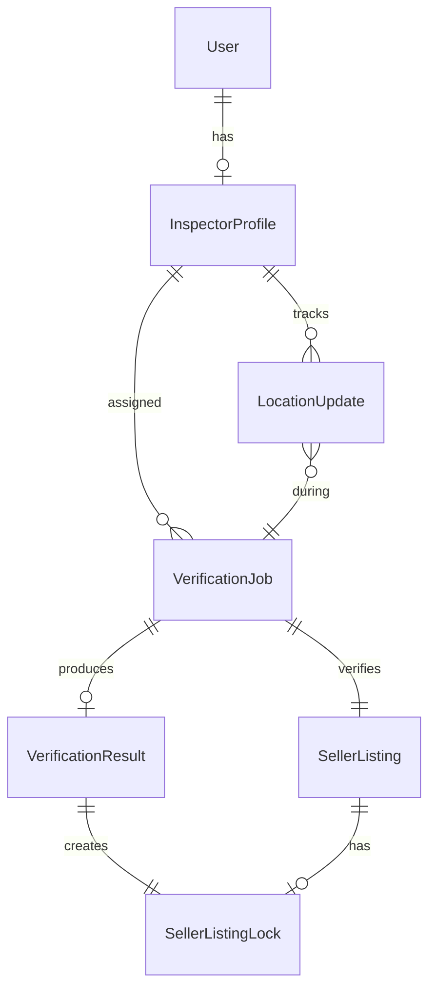

# Data Model: Inspector/Verifier Profile

## Core Entities

### VerificationJob
Represents a quality verification assignment for an inspector.

```typescript
interface VerificationJob {
  id: string;
  sellerListingId: string;
  inspectorId?: string; // null if unassigned
  priority: JobPriority;
  status: JobStatus;
  location: LocationCoordinates;
  productDetails: ProductSummary;
  scheduledDate?: Date;
  acceptedAt?: Date;
  completedAt?: Date;
  estimatedDuration: number; // minutes
  distance?: number; // km from inspector
  createdAt: Date;
  updatedAt: Date;
}

enum JobPriority {
  LOW = 'LOW',      // white background
  MEDIUM = 'MEDIUM', // yellow background  
  HIGH = 'HIGH'      // red background
}

enum JobStatus {
  PENDING = 'PENDING',
  ASSIGNED = 'ASSIGNED',
  IN_PROGRESS = 'IN_PROGRESS',
  COMPLETED = 'COMPLETED',
  FAILED = 'FAILED',
  CANCELLED = 'CANCELLED'
}

interface LocationCoordinates {
  latitude: number;
  longitude: number;
  address: string;
  city: string;
  region: string;
}

interface ProductSummary {
  name: string;
  type: string;
  quantity: number;
  unit: string;
  claimedSpecs: Record<string, any>;
}
```

### InspectorProfile
Extension of user profile for inspectors.

```typescript
interface InspectorProfile {
  id: string;
  userId: string;
  employeeId: string;
  specializations: string[]; // crop types they can verify
  certifications: Certification[];
  activeJobId?: string;
  currentLocation?: LocationUpdate;
  isAvailable: boolean;
  workingHours: WorkingHours;
  totalJobsCompleted: number;
  averageRating: number;
  createdAt: Date;
  updatedAt: Date;
}

interface Certification {
  name: string;
  issuedBy: string;
  validUntil: Date;
  documentUrl?: string;
}

interface WorkingHours {
  start: string; // "09:00"
  end: string;   // "18:00"
  workDays: number[]; // 1-7 (Mon-Sun)
}
```

### LocationUpdate
Real-time position tracking data.

```typescript
interface LocationUpdate {
  id: string;
  inspectorId: string;
  jobId?: string; // linked to active job
  coordinates: {
    latitude: number;
    longitude: number;
    accuracy: number; // meters
    altitude?: number;
    heading?: number; // degrees
    speed?: number; // m/s
  };
  timestamp: Date;
  batteryLevel?: number;
  networkType?: 'wifi' | 'cellular' | 'none';
  isMoving: boolean;
}
```

### VerificationResult
Outcome of crop quality testing.

```typescript
interface VerificationResult {
  id: string;
  jobId: string;
  inspectorId: string;
  sellerListingId: string;
  originalSpecs: Record<string, any>;
  verifiedSpecs: Record<string, any>;
  testMethods: TestMethod[];
  evidence: Evidence[];
  notes: string;
  verificationStatus: VerificationStatus;
  signature?: string; // digital signature
  verifiedAt: Date;
  createdAt: Date;
}

interface TestMethod {
  parameter: string;
  method: string;
  equipment: string;
  standardUsed?: string;
}

interface Evidence {
  type: 'photo' | 'document' | 'video';
  url: string;
  caption?: string;
  timestamp: Date;
}

enum VerificationStatus {
  VERIFIED = 'VERIFIED',
  PARTIALLY_VERIFIED = 'PARTIALLY_VERIFIED',
  FAILED = 'FAILED',
  PENDING_REVIEW = 'PENDING_REVIEW'
}
```

### SellerListingLock
Tracks verification state of seller listings.

```typescript
interface SellerListingLock {
  listingId: string;
  isLocked: boolean;
  lockedFields: string[]; // specification fields that cannot be edited
  verificationResultId?: string;
  lockedAt?: Date;
  lockedBy?: string; // inspector ID
  unlockRequested?: boolean;
  unlockReason?: string;
}
```

## Relationships



## State Transitions

### Job Status Flow
```
PENDING → ASSIGNED → IN_PROGRESS → COMPLETED
                  ↓              ↓
               CANCELLED      FAILED
```

### Verification Status Flow
```
PENDING_REVIEW → VERIFIED
              ↓
         PARTIALLY_VERIFIED
              ↓
           FAILED
```

## Validation Rules

### VerificationJob
- Priority must be one of: LOW, MEDIUM, HIGH
- Location coordinates must be valid lat/lng
- Estimated duration must be > 0
- Cannot transition from COMPLETED back to IN_PROGRESS

### InspectorProfile
- Employee ID must be unique
- Working hours must be valid time format
- Certifications must have future valid dates
- Average rating between 0-5

### LocationUpdate
- Coordinates must be within valid ranges
- Accuracy must be positive number
- Timestamp cannot be future date
- Battery level between 0-100

### VerificationResult
- Verified specs must include all required fields
- At least one test method required
- Evidence URLs must be valid
- Notes required if status is FAILED

## Mock Data Examples

```typescript
const mockVerificationJob: VerificationJob = {
  id: "job-001",
  sellerListingId: "listing-123",
  inspectorId: "inspector-001",
  priority: JobPriority.HIGH,
  status: JobStatus.PENDING,
  location: {
    latitude: 42.6977,
    longitude: 23.3219,
    address: "Field Road 123",
    city: "Plovdiv",
    region: "Plovdiv Province"
  },
  productDetails: {
    name: "Wheat Grade A",
    type: "Grain",
    quantity: 1000,
    unit: "kg",
    claimedSpecs: {
      moisture: "12%",
      protein: "14%",
      gluten: "28%"
    }
  },
  estimatedDuration: 120,
  distance: 25.5,
  createdAt: new Date("2025-01-13"),
  updatedAt: new Date("2025-01-13")
};

const mockLocationUpdate: LocationUpdate = {
  id: "loc-001",
  inspectorId: "inspector-001",
  jobId: "job-001",
  coordinates: {
    latitude: 42.6977,
    longitude: 23.3219,
    accuracy: 10,
    heading: 45,
    speed: 15.5
  },
  timestamp: new Date(),
  batteryLevel: 85,
  networkType: 'cellular',
  isMoving: true
};
```

## Database Schema Updates

### Prisma Schema Additions
```prisma
model InspectorProfile {
  id                String   @id @default(cuid())
  userId            String   @unique
  user              User     @relation(fields: [userId], references: [id])
  employeeId        String   @unique
  specializations   String[]
  certifications    Json
  activeJobId       String?
  isAvailable       Boolean  @default(true)
  workingHours      Json
  totalJobsCompleted Int     @default(0)
  averageRating     Float    @default(0)
  jobs              VerificationJob[]
  locationUpdates   LocationUpdate[]
  results           VerificationResult[]
  createdAt         DateTime @default(now())
  updatedAt         DateTime @updatedAt
}

model VerificationJob {
  id              String   @id @default(cuid())
  sellerListingId String
  listing         SellerListing @relation(fields: [sellerListingId], references: [id])
  inspectorId     String?
  inspector       InspectorProfile? @relation(fields: [inspectorId], references: [id])
  priority        String   // JobPriority enum
  status          String   // JobStatus enum
  location        Json
  productDetails  Json
  scheduledDate   DateTime?
  acceptedAt      DateTime?
  completedAt     DateTime?
  estimatedDuration Int
  result          VerificationResult?
  locationUpdates LocationUpdate[]
  createdAt       DateTime @default(now())
  updatedAt       DateTime @updatedAt
}

model LocationUpdate {
  id          String   @id @default(cuid())
  inspectorId String
  inspector   InspectorProfile @relation(fields: [inspectorId], references: [id])
  jobId       String?
  job         VerificationJob? @relation(fields: [jobId], references: [id])
  coordinates Json
  timestamp   DateTime
  batteryLevel Int?
  networkType String?
  isMoving    Boolean
}

model VerificationResult {
  id               String   @id @default(cuid())
  jobId            String   @unique
  job              VerificationJob @relation(fields: [jobId], references: [id])
  inspectorId      String
  inspector        InspectorProfile @relation(fields: [inspectorId], references: [id])
  sellerListingId  String
  originalSpecs    Json
  verifiedSpecs    Json
  testMethods      Json
  evidence         Json
  notes            String
  verificationStatus String
  signature        String?
  verifiedAt       DateTime
  lock             SellerListingLock?
  createdAt        DateTime @default(now())
}

model SellerListingLock {
  id                 String   @id @default(cuid())
  listingId          String   @unique
  listing            SellerListing @relation(fields: [listingId], references: [id])
  isLocked           Boolean  @default(true)
  lockedFields       String[]
  verificationResultId String? @unique
  result             VerificationResult? @relation(fields: [verificationResultId], references: [id])
  lockedAt           DateTime?
  lockedBy           String?
  unlockRequested    Boolean  @default(false)
  unlockReason       String?
}
```