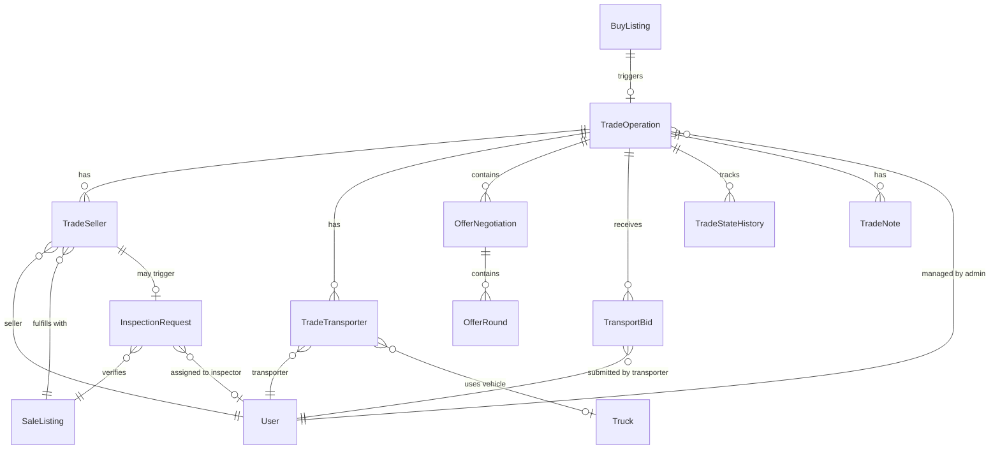

# Data Model: Trade Operation Management System

## Integration with Existing Schema

This data model extends the existing Agro-Trade database schema. The new entities will be added to the current Prisma schema file, maintaining consistency with existing naming conventions and relationships.

### Existing Entities We'll Use (NO DUPLICATION):
- **BuyListing**: Already contains all buyer requirements (product, specs, quantity, budget, location)
- **SaleListing**: Already contains seller offerings with specifications
- **Product**: Already has complete product definitions with spec templates
- **ListingSpec**: Already handles specification requirements and values
- **Address**: Already stores delivery locations
- **User**: Existing user system with roles
- **Offer**: Existing offer system (may need slight extension)

### Entities We'll Add Relations To:
- **User**: Add relations for trade operations, negotiations, inspections
- **SaleListing**: Add relations for trade sellers and inspections
- **BuyListing**: Add relation for trade operations (one BuyListing can trigger a TradeOperation)
- **Truck**: Add relation for trade transporters

## Entity Relationship Diagram



## Core Entities (New Tables for Prisma Schema)

### TradeOperation
**Purpose**: Orchestrates fulfillment of a BuyListing through multiple sellers and transporters  
**Prisma Model Name**: `TradeOperation`  
**Table Name**: `trade_operations`

| Field | Type | Description | Constraints |
|-------|------|-------------|-------------|
| id | String @id @default(cuid()) | Unique identifier | Primary Key |
| operationNumber | String @unique | Human-readable ID | Format: TRADE-YYYY-MMDD-XXXX |
| adminId | String | Managing administrator | Foreign Key → User (role=ADMIN) |
| buyListingId | String @unique | Buy request being fulfilled | Foreign Key → BuyListing |
| phase | TradePhase | Current phase | See TradePhase enum |
| status | TradeStatus | Operation status | See TradeStatus enum |
| totalValue | Decimal? @db.Decimal(10,2) | Total deal value | Calculated from sellers |
| currency | String @default("EUR") | Currency code | Default: EUR |
| commissionAmount | Decimal? @db.Decimal(10,2) | Platform commission | 2.5% seller + 1.5% buyer |
| initiatedAt | DateTime @default(now()) | Creation timestamp | Auto-generated |
| completedAt | DateTime? | Completion timestamp | Nullable |
| metadata | Json? | Additional data | Flexible storage |
| createdAt | DateTime @default(now()) | Standard timestamp | Auto-generated |
| updatedAt | DateTime @updatedAt | Update timestamp | Auto-updated |

**Indexes**: adminId, buyListingId, phase, status, operationNumber
**Note**: buyListingId is UNIQUE because one BuyListing = one TradeOperation

### TradeSeller
**Purpose**: Links selected SaleListings to fulfill the BuyListing requirements

| Field | Type | Description | Constraints |
|-------|------|-------------|-------------|
| id | String @id @default(cuid()) | Unique identifier | Primary Key |
| tradeOperationId | String | Parent trade | Foreign Key → TradeOperation |
| sellerId | String | Participating seller | Foreign Key → User (role=FARMER) |
| saleListingId | String | Seller's listing | Foreign Key → SaleListing (REQUIRED) |
| requestedQuantity | Decimal @db.Decimal(10,2) | Quantity needed | From buyer requirement |
| offeredQuantity | Decimal @db.Decimal(10,2) | Available from seller | From SaleListing |
| agreedQuantity | Decimal? @db.Decimal(10,2) | Final agreed amount | After negotiation |
| unit | ProductUnit | Measurement unit | Must match BuyListing |
| agreedPrice | Decimal? @db.Decimal(10,2) | Final price per unit | After negotiation |
| isVerified | Boolean @default(false) | Product verification | From inspection |
| status | SellerStatus | Seller status | See SellerStatus enum |
| matchScore | Int? | Quality of match (0-100) | Based on spec alignment |
| joinedAt | DateTime @default(now()) | When added to trade | Auto-generated |
| confirmedAt | DateTime? | When seller confirmed | Nullable |

**Unique Constraint**: (tradeOperationId, saleListingId)
**Indexes**: tradeOperationId, sellerId, saleListingId, status

### TradeTransporter
**Purpose**: Manages transporter assignments for trade operations

| Field | Type | Description | Constraints |
|-------|------|-------------|-------------|
| id | UUID | Unique identifier | Primary Key |
| tradeOperationId | UUID | Parent trade | Foreign Key → TradeOperation |
| transporterId | UUID | Assigned transporter | Foreign Key → User |
| pickupSellerId | UUID? | Pickup location | Foreign Key → TradeSeller |
| route | JSON? | Route details | GeoJSON format |
| estimatedDistance | Float? | Distance in km | Nullable |
| estimatedDuration | Integer? | Duration in minutes | Nullable |
| agreedPrice | Decimal? | Transport cost | Precision: 10,2 |
| vehicleId | UUID? | Assigned vehicle | Foreign Key → Truck |
| status | Enum | Transport status | See TransporterStatus enum |
| assignedAt | DateTime | Assignment time | Default: now() |
| confirmedAt | DateTime? | Confirmation time | Nullable |
| deliveredAt | DateTime? | Delivery time | Nullable |

**Unique Constraint**: (tradeOperationId, transporterId)
**Indexes**: tradeOperationId, transporterId, status

### OfferNegotiation
**Purpose**: Tracks price negotiations between parties

| Field | Type | Description | Constraints |
|-------|------|-------------|-------------|
| id | UUID | Unique identifier | Primary Key |
| tradeOperationId | UUID | Parent trade | Foreign Key → TradeOperation |
| buyerId | UUID | Buyer party | Foreign Key → User |
| sellerId | UUID | Seller party | Foreign Key → User |
| status | Enum | Negotiation status | See NegotiationStatus enum |
| initialOffer | Decimal | First offer | Precision: 10,2 |
| currentOffer | Decimal | Latest offer | Precision: 10,2 |
| finalPrice | Decimal? | Agreed price | Precision: 10,2 |
| quantity | Decimal | Negotiated amount | Precision: 10,2 |
| unit | Enum | Measurement unit | See ProductUnit enum |
| termsAndConditions | Text? | Special terms | Nullable |
| startedAt | DateTime | Start time | Default: now() |
| concludedAt | DateTime? | End time | Nullable |
| expiresAt | DateTime | Expiration | Default: now() + 48h |

**Indexes**: tradeOperationId, buyerId, sellerId, status

### OfferRound
**Purpose**: Individual offer/counter-offer within negotiation

| Field | Type | Description | Constraints |
|-------|------|-------------|-------------|
| id | UUID | Unique identifier | Primary Key |
| negotiationId | UUID | Parent negotiation | Foreign Key → OfferNegotiation |
| roundNumber | Integer | Sequence number | Auto-increment per negotiation |
| offeredBy | Enum | Who made offer | See OfferParty enum |
| price | Decimal | Offered price | Precision: 10,2 |
| quantity | Decimal | Offered quantity | Precision: 10,2 |
| terms | Text? | Additional terms | Nullable |
| response | Enum? | Response type | See OfferResponse enum |
| responseNote | Text? | Response message | Nullable |
| createdAt | DateTime | Creation time | Default: now() |
| respondedAt | DateTime? | Response time | Nullable |

**Unique Constraint**: (negotiationId, roundNumber)
**Indexes**: negotiationId, createdAt

### InspectionRequest
**Purpose**: Quality verification tasks for products

| Field | Type | Description | Constraints |
|-------|------|-------------|-------------|
| id | UUID | Unique identifier | Primary Key |
| tradeOperationId | UUID? | Related trade | Foreign Key → TradeOperation |
| saleListingId | UUID | Product to verify | Foreign Key → SaleListing |
| inspectorId | UUID? | Assigned inspector | Foreign Key → User |
| priority | Enum | Task priority | See InspectionPriority enum |
| requestedDate | DateTime? | Requested date | Nullable |
| scheduledDate | DateTime? | Scheduled date | Nullable |
| completedDate | DateTime? | Completion date | Nullable |
| latitude | Float | Location latitude | Required |
| longitude | Float | Location longitude | Required |
| address | String? | Physical address | Nullable |
| status | Enum | Current status | See InspectionStatus enum |
| qualityScore | Integer? | Score 0-100 | Nullable |
| verificationResult | JSON? | Detailed results | Structured data |
| notes | Text? | Inspector notes | Nullable |
| photos | String[] | Photo URLs | Array of strings |
| createdAt | DateTime | Creation time | Default: now() |

**Indexes**: tradeOperationId, saleListingId, inspectorId, status, priority

### TransportBid
**Purpose**: Transport proposals for trade operations

| Field | Type | Description | Constraints |
|-------|------|-------------|-------------|
| id | UUID | Unique identifier | Primary Key |
| tradeOperationId | UUID | Parent trade | Foreign Key → TradeOperation |
| transporterId | UUID | Bidding transporter | Foreign Key → User |
| bidAmount | Decimal | Bid price | Precision: 10,2 |
| estimatedDuration | Integer | Hours to deliver | Required |
| vehicleType | Enum | Vehicle type | See TruckType enum |
| vehicleCapacity | Float | Capacity in tons | Required |
| specialEquipment | String[] | Equipment list | Array |
| insuranceCoverage | Decimal? | Insurance amount | Precision: 10,2 |
| proposedRoute | JSON? | Suggested route | GeoJSON |
| status | Enum | Bid status | See BidStatus enum |
| submittedAt | DateTime | Submission time | Default: now() |
| expiresAt | DateTime | Expiration time | Required |

**Indexes**: tradeOperationId, transporterId, status, submittedAt

### TradeStateHistory
**Purpose**: Immutable audit trail of state changes

| Field | Type | Description | Constraints |
|-------|------|-------------|-------------|
| id | UUID | Unique identifier | Primary Key |
| tradeOperationId | UUID | Parent trade | Foreign Key → TradeOperation |
| fromPhase | Enum? | Previous phase | See TradePhase enum |
| toPhase | Enum | New phase | See TradePhase enum |
| fromStatus | Enum? | Previous status | See TradeStatus enum |
| toStatus | Enum? | New status | See TradeStatus enum |
| changedBy | UUID | User who changed | Foreign Key → User |
| reason | String? | Change reason | Nullable |
| metadata | JSON? | Additional context | Nullable |
| changedAt | DateTime | Change timestamp | Default: now() |

**Indexes**: tradeOperationId, changedBy, changedAt

### TradeNote
**Purpose**: Comments and internal notes on trades

| Field | Type | Description | Constraints |
|-------|------|-------------|-------------|
| id | UUID | Unique identifier | Primary Key |
| tradeOperationId | UUID | Parent trade | Foreign Key → TradeOperation |
| authorId | UUID | Note author | Foreign Key → User |
| content | Text | Note content | Required |
| isInternal | Boolean | Admin-only flag | Default: true |
| attachments | String[]? | File URLs | Array |
| createdAt | DateTime | Creation time | Default: now() |

**Indexes**: tradeOperationId, authorId, createdAt

## Enumerations

### TradePhase
```typescript
enum TradePhase {
  INITIATION = "INITIATION",
  SELLER_MATCHING = "SELLER_MATCHING",
  SELLER_NEGOTIATION = "SELLER_NEGOTIATION", 
  INSPECTION_PENDING = "INSPECTION_PENDING",
  TRANSPORT_MATCHING = "TRANSPORT_MATCHING",
  TRANSPORT_BIDDING = "TRANSPORT_BIDDING",
  IN_TRANSIT = "IN_TRANSIT",
  DELIVERED = "DELIVERED",
  COMPLETED = "COMPLETED",
  CANCELLED = "CANCELLED"
}
```

### TradeStatus
```typescript
enum TradeStatus {
  ACTIVE = "ACTIVE",
  ON_HOLD = "ON_HOLD",
  COMPLETED = "COMPLETED",
  CANCELLED = "CANCELLED",
  DISPUTED = "DISPUTED"
}
```

### SellerStatus
```typescript
enum SellerStatus {
  INVITED = "INVITED",
  NEGOTIATING = "NEGOTIATING",
  ACCEPTED = "ACCEPTED",
  REJECTED = "REJECTED",
  CONFIRMED = "CONFIRMED",
  WITHDRAWN = "WITHDRAWN"
}
```

### TransporterStatus
```typescript
enum TransporterStatus {
  INVITED = "INVITED",
  BIDDING = "BIDDING",
  SELECTED = "SELECTED",
  CONFIRMED = "CONFIRMED",
  IN_TRANSIT = "IN_TRANSIT",
  DELIVERED = "DELIVERED",
  CANCELLED = "CANCELLED"
}
```

### NegotiationStatus
```typescript
enum NegotiationStatus {
  ACTIVE = "ACTIVE",
  AGREED = "AGREED",
  FAILED = "FAILED",
  EXPIRED = "EXPIRED"
}
```

### OfferParty
```typescript
enum OfferParty {
  BUYER = "BUYER",
  SELLER = "SELLER",
  PLATFORM = "PLATFORM"
}
```

### OfferResponse
```typescript
enum OfferResponse {
  ACCEPTED = "ACCEPTED",
  REJECTED = "REJECTED",
  COUNTERED = "COUNTERED"
}
```

### InspectionPriority
```typescript
enum InspectionPriority {
  LOW = "LOW",
  MEDIUM = "MEDIUM",
  HIGH = "HIGH",
  URGENT = "URGENT"
}
```

### InspectionStatus
```typescript
enum InspectionStatus {
  PENDING = "PENDING",
  SCHEDULED = "SCHEDULED",
  IN_PROGRESS = "IN_PROGRESS",
  COMPLETED = "COMPLETED",
  CANCELLED = "CANCELLED"
}
```

### BidStatus
```typescript
enum BidStatus {
  PENDING = "PENDING",
  ACCEPTED = "ACCEPTED",
  REJECTED = "REJECTED",
  EXPIRED = "EXPIRED",
  WITHDRAWN = "WITHDRAWN"
}
```

## State Transitions

### Valid Phase Transitions
```
INITIATION → SELLER_MATCHING
SELLER_MATCHING → SELLER_NEGOTIATION | CANCELLED
SELLER_NEGOTIATION → INSPECTION_PENDING | TRANSPORT_MATCHING | SELLER_MATCHING
INSPECTION_PENDING → SELLER_NEGOTIATION | TRANSPORT_MATCHING
TRANSPORT_MATCHING → TRANSPORT_BIDDING | CANCELLED
TRANSPORT_BIDDING → IN_TRANSIT | TRANSPORT_MATCHING
IN_TRANSIT → DELIVERED
DELIVERED → COMPLETED
ANY → CANCELLED (with restrictions)
```

### Status Constraints by Phase
- INITIATION: Only ACTIVE
- SELLER_MATCHING: ACTIVE or ON_HOLD
- SELLER_NEGOTIATION: ACTIVE, ON_HOLD, or DISPUTED
- INSPECTION_PENDING: ACTIVE or ON_HOLD
- TRANSPORT_MATCHING: ACTIVE or ON_HOLD
- TRANSPORT_BIDDING: ACTIVE only
- IN_TRANSIT: ACTIVE only
- DELIVERED: ACTIVE or DISPUTED
- COMPLETED: COMPLETED only
- CANCELLED: CANCELLED only

## Data Integrity Rules

1. **Trade Operation**:
   - Cannot delete if status != CANCELLED
   - totalValue must equal sum of seller agreed prices
   - targetDelivery must be future date

2. **Trade Seller**:
   - Cannot add sellers after TRANSPORT_MATCHING phase
   - agreedPrice required before TRANSPORT_MATCHING
   - isVerified = true requires verificationId

3. **Offer Negotiation**:
   - expiresAt cannot be changed after creation
   - finalPrice required when status = AGREED
   - Cannot create new rounds after expiration

4. **Inspection Request**:
   - Priority URGENT requires immediate scheduling
   - qualityScore required when status = COMPLETED
   - Cannot cancel if status = IN_PROGRESS

5. **Transport Bid**:
   - Cannot submit after bidding deadline
   - Only one accepted bid per trade operation
   - bidAmount cannot be modified after submission

## Performance Considerations

### Indexes Required
- Geospatial index on InspectionRequest (latitude, longitude)
- Composite index on TradeOperation (phase, status)
- Partial index on OfferNegotiation where status = 'ACTIVE'
- Temporal index on TradeStateHistory (changedAt DESC)

### Materialized Views
- Active trades by region
- Seller verification status summary
- Average negotiation duration by product
- Transport bid participation rates

### Partitioning Strategy
- TradeStateHistory by month (changedAt)
- TradeNote by year (createdAt)
- Completed TradeOperations by quarter